# Architecture

GILM is a single-process FastAPI application with two separate entry points:

```mermaid
flowchart LR
    A[Assembled chat request] --> B[Authenticate and validate]
    R[Reporting parameters] --> B
    B --> P[Resolve scoped immutable plan]
    P --> S[Approved read-only SQL adapter]
    S --> C[Build context with provenance]
    P --> T[Validate eligible context transformations]
    C --> T
    T --> K[Scoped exact cache if eligible]
    K --> V[Mock or configured HTTP provider]
    V --> Q[Reporting correctness checks]
    Q --> L[Metadata trace and accounting]
    L --> D[Dashboard and evaluation export]
```

`models.py` defines the deliberately small request contract and complete plan configuration. `config.py` binds operator-provided keys to tenant/branch permissions and a management capability. `app.py` bounds request bodies, assigns server request IDs, authenticates API routes, sanitizes validation errors, and cancels nonstream work on disconnect.

`store.py` manages SQLite state using scoped parameterized queries. Baseline plans are created once. Candidate rows include a parent, configuration digest, description, workflow applicability, source versions, expiry, and creation time. SQLite triggers prohibit updates/deletes. Evaluation and activation records are separate append-only application events; the active pointer can change. Rollback is restricted to the active plan's ancestry. Source and evaluation freshness are checked before activation. This is application traceability, not a cryptographically tamper-proof audit ledger against a database administrator.

`context.py` verifies block identity, role, hashes, dependencies, retention, and redundancy. It removes only an explicitly eligible optional user-context message with an identical annotated source/version/content and an identical retained message. System/developer/assistant/tool messages, the final user message, explicitly protected data, and required blocks cannot be removed. Tools and definitions remain part of the forwarded payload. An annotation failure returns the entire original validated request unchanged before dispatch.

`adapter.py` is the upstream integration boundary. API clients submit dates and authorized branches, never SQL or a file path. The query registry contains only `sales.detail.v1` and `sales.totals.v1`. Projection accepts allowlisted identifiers and must preserve all answer fields. SQLite is opened read-only with extension loading disabled, query-only mode, an action/table/column/function authorizer, row/byte limits, and a progress-handler deadline. The version hash and query results are read in one transaction. Sources are scoped to permitted tenant/branch rows. Both paths provide definitions, currency, requested branches, interval semantics, and provenance, including zero-sales branches.

`engine.py` applies plans, computes exact cache identities, dispatches once, validates reporting answers, and stores metadata. Fallback is pre-dispatch only. Authentication/authorization errors do not fall back. Reporting responses are checked for required fields, totals, completeness, allowed branches, dates, currency, and source version. All tools are pass-through descriptions/history; no action is executed or replayed. Normal chat correctness is not inferred from a mock response.

Streaming requests use the baseline provider and original payload, bypassing all plan overrides, transformations, and caching. `HTTPProvider` opens an upstream stream before the response headers are sent and yields its raw SSE bytes. It uses HTTPX streaming rather than reconstructing events ([HTTPX async streaming documentation](https://www.python-httpx.org/async/#streaming-responses)). Upstream handles close on completion, cancellation, and failure. Once bytes have been forwarded, failures terminate the stream without inserting fabricated events or restarting a call. Streaming token usage is left unknown because the stream is not parsed for accounting.

`evaluation.py` compares complete workflows, including a manual aggregate control. Separate development and held-out fixtures have explicit expected answers. Cold trials invalidate GILM's response cache; warm trials immediately repeat the same request. They do not promise a cold upstream provider cache or unloaded local model. The result records quality, costs, cache state, and latency together. Activation requires complete, passing candidate fixtures and remains explicit; reference-plan failures are reported independently. The mock runner exercises system mechanics. The opt-in live runner calls the configured HTTP provider, which can be an actual local Ollama model or an explicitly configured remote model. Adversarial and failure cases are additionally exercised by the pytest suite.

`budget.py` wraps only the evaluation's provider instance. It reserves a conservative amount before each call using the configured provider-enforced input ceiling, explicit output cap, and rate-card version. It limits attempts, retains reservations after failures, and aborts further calls on ambiguous failure or unknown usage. Normal production traffic is unaffected by a concurrent evaluation's budget. This is a rate-card guard under declared assumptions; provider-side hard limits are needed for an invoice-level guarantee. Completed quality failures are scored, while remaining preplanned independent fixture trials can continue within the same guard. No failed call triggers a hidden fallback retry.

`002_cache_generations.sql` adds a persistent generation counter per authorization scope. Cache identities carry the generation, and writes use an atomic SQL condition to reject stale generations. Invalidation and activation increment the counter, so an in-flight request cannot repopulate a cache that was invalidated while it awaited its provider response.

The UI is static HTML/CSS/JavaScript with a restrictive CSP. It only reads real API data and renders external values with `textContent`. It does not store API keys in local storage. All databases remain local; Redis is unnecessary for this MVP.

## Practical boundaries

Synchronous SQLite calls run on the application thread and are bounded for small synthetic fixtures. Large datasets and concurrent workloads need asynchronous/threaded adapter execution, pagination or materialized snapshots, robust migration locking, rate limits, and operational load tests. The snapshot scan itself has the row/byte limits; this intentionally rejects oversized sources rather than silently dropping records. The baseline demo includes explicitly duplicated definitions to exercise duplicate removal; this synthetic redundancy is not evidence that real applications contain the same overhead.
